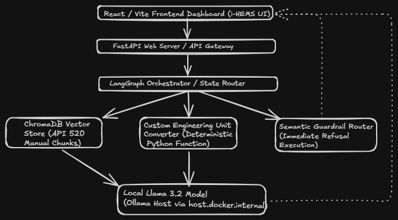

# i-HEMS: Digital Process Engineer (Local RAG Architecture)

[](YOUR_YOUTUBE_LINK_HERE)

An offline, privacy-first Retrieval-Augmented Generation (RAG) assistant integrated into a Hybrid Renewable Energy Management System (i-HEMS). Built to act as a deterministic Digital Process Engineer capable of analyzing dense API standards, executing mathematical conversions, and maintaining strict conversational boundaries.

## 🏗️ Architecture & Tech Stack
* **Frontend:** React, Vite, Tailwind CSS (Multi-tenant JWT Authentication)
* **Backend:** FastAPI, Python, LangGraph
* **AI & Data:** Llama 3.2 (Local via Ollama), ChromaDB (Vector Siloing), HuggingFace Embeddings
* **Infrastructure:** Fully Dockerized (Containerized multi-service deployment)



## 🚀 Key Enterprise Features
1. **Multi-Tenant Vector Security:** Implemented JWT-based vector siloing. Document chunks are cryptographically bound to specific session IDs, ensuring absolute data privacy between users.
2. **Deterministic Tool Handoffs:** Utilized LangGraph to integrate custom Python tools (e.g., Process Unit Converter). The LLM bypasses mathematical hallucination by routing numerical calculations to isolated Python functions.
3. **Automated Quantitative Testing:** Built an automated evaluation pipeline using the **RAGAS** framework. Mathematically verified the pipeline's *Faithfulness* and *Context Precision* against the highly technical API 520 Part II engineering standard.
4. **Semantic Guardrails:** Engineered strict system prompts and routing logic to actively block off-topic queries, saving local compute latency and protecting the AI's professional persona.

## ⚙️ Local Deployment
```bash
git clone <your-repo-url>
cd process-engineer
docker compose up --build -d